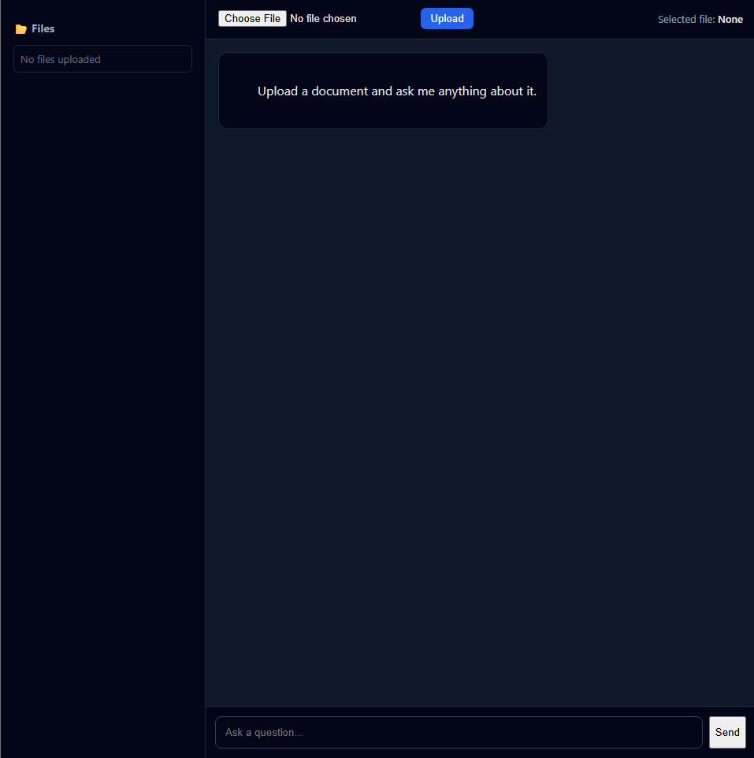

# 📚 Knowledge Vault — RAG-Powered Document Q&A

A **local, ChatGPT-style Retrieval-Augmented Generation (RAG) application** that allows users to upload documents and ask questions grounded strictly in their content.

Built with **FastAPI + FAISS + Ollama**, this project focuses on **correct RAG architecture, file-scoped retrieval, and production-grade guardrails** — not just a toy demo.

---

## ✨ Features

- 📂 Upload and manage multiple PDF documents
- 🔍 Ask natural language questions grounded **only in selected files**
- 🧠 Retrieval-Augmented Generation (RAG) using vector search
- 🗂️ File-scoped querying (no cross-document leakage)
- 🧾 Source attribution per answer
- 🚫 Hallucination guards for weak or unreadable PDFs
- 💬 ChatGPT-style UI (sidebar + chat + fixed input)
- ⚙️ Fully local — no external APIs required

---

## 🏗️ Architecture Overview

```text
Frontend (HTML/CSS/JS)
↓
FastAPI Backend
↓
Embeddings (SentenceTransformers)
↓
FAISS Vector Store
↓
Ollama (llama3)
```


### RAG Flow
1. User uploads a PDF
2. Text is extracted, chunked, embedded
3. Embeddings stored in FAISS with metadata
4. User selects a file + asks a question
5. Retrieval happens **only within that file**
6. LLM answers strictly from retrieved context

---

## 📁 Project Structure

```text

backend/
├── embeddings.py
├── ingest.py
├── llm.py
├── main.py
├── rag.py
├── vector_store.py
└── init.py

data/
├── documents/ # All uploaded PDFs
└── faiss_index/ # Vector index + metadata

frontend/
├── index.html
├── style.css
└── app.js

requirements.txt
README.md

```

## Website UI Preview


